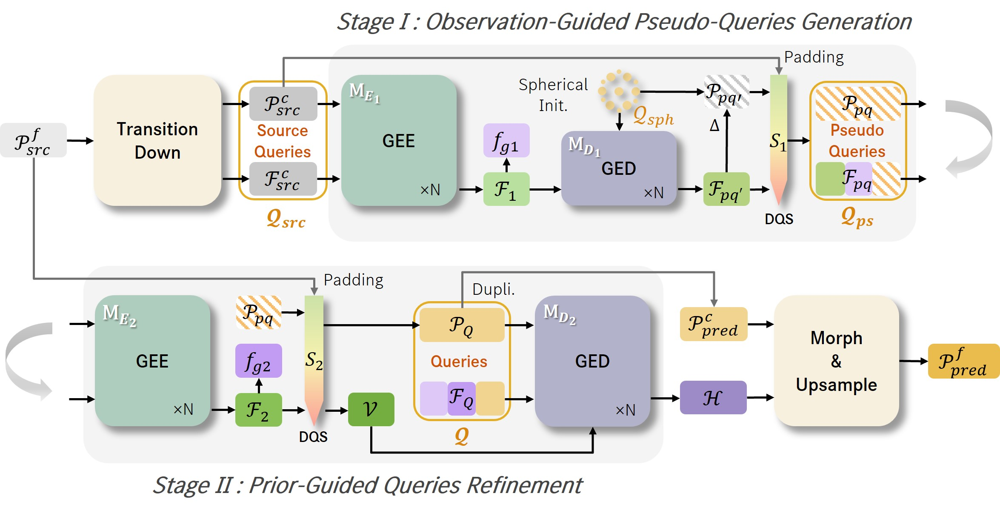

# PQDT: Pseudo-Query Dual Transformer for Robust Point Cloud Restoration

<div align="center">
  
</div>


## Environment

```bash
conda create -n pqdt python=3.12
conda activate pqdt
pip install -r requirements.txt
bash install.sh
```

`install.sh` builds the local CUDA/C++ extensions used by point-cloud sampling and losses.

## Dataset

Set `dataset.dataset_dir` in the YAML config to the directory that contains `ShapeNet55-34/`.
All ShapeNet restoration data is resolved below that folder:

```text
<dataset_dir>/ShapeNet55-34/
    ShapeNet-55/
    shapenet_pc/
    Occ_ShapeNet_Car_Noise/
    occ_partial_noise/
    shapenet_occlusion/
```

### ShapeNet55/34

Download the dataset from the [PoinTr dataset instructions](https://github.com/yuxumin/PoinTr/blob/master/DATASET.md) and keep the same directory structure.

### ShapeNet-Deform

The deformed ShapeNet55 variant is generated online by `pqdt/data/deformed_shapenet.py`.

### ShapeNetCar-Occ

Download the processed data from: (Todo)

Use scripts in `scripts/occlude` to generate partial point clouds from meshes:

```bash
python scripts/occlude/generate.py --dataset_dir /path/to/datasets --bbox_rescale_factor 1.1 --noise_std 0.003 --occ_num_lower_bound 10 --id_bias 0
python scripts/occlude/generate.py --dataset_dir /path/to/datasets --bbox_rescale_factor 1.2 --noise_std 0.004 --occ_num_lower_bound 20 --id_bias 32
python scripts/occlude/generate.py --dataset_dir /path/to/datasets --bbox_rescale_factor 1.3 --noise_std 0.005 --occ_num_lower_bound 30 --id_bias 64
python scripts/occlude/raycast_surface.py --dataset_dir /path/to/datasets
```

## Configs

Restoration configs live under `configs/restoration/`:

```text
configs/restoration/shapenet55.yml
configs/restoration/shapenet_deform.yml
configs/restoration/shapenet_occ.yml
```

Each config uses explicit sections for `dataset`, `dataloader`, `trainer`, `optimizer`, `scheduler`, `logger`, and `checkpoint`.

## Training

Edit the YAML files to set dataset, checkpoint, and logging paths, then run:

```bash
python train.py --config configs/restoration/shapenet55.yml
```

View experiments:

```bash
tensorboard --logdir ./lightning_logs
```

## Test

```bash
python test.py \
  --config configs/restoration/shapenet55.yml \
  --ckpt ./lightning_logs/ckpts/last.ckpt
```

If `--ckpt` is omitted, `checkpoint.test_path` from the config is used.

## Citation

If you find this repository useful, please cite our paper:

```bibtex
@inproceedings{,
  title={},
  author={},
  booktitle={},
  volume={},
  year={}
}
```
